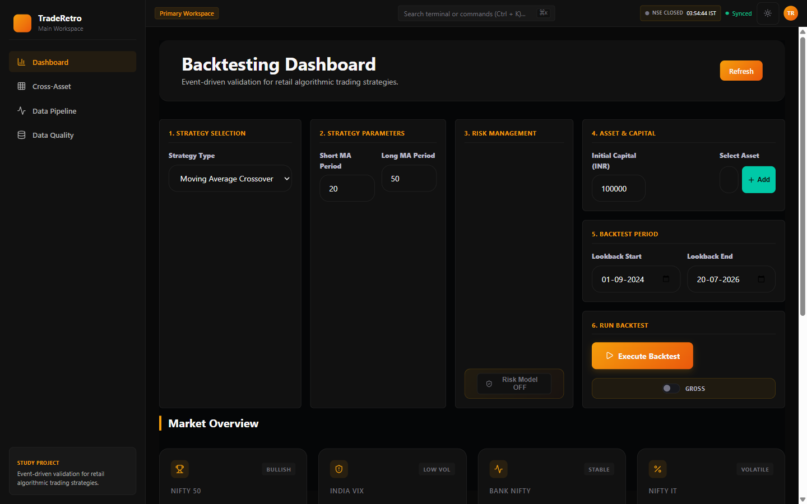
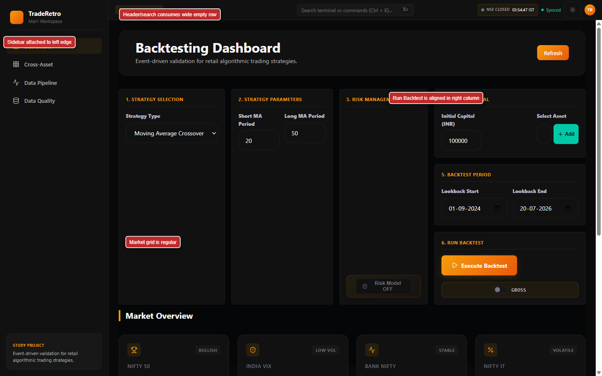
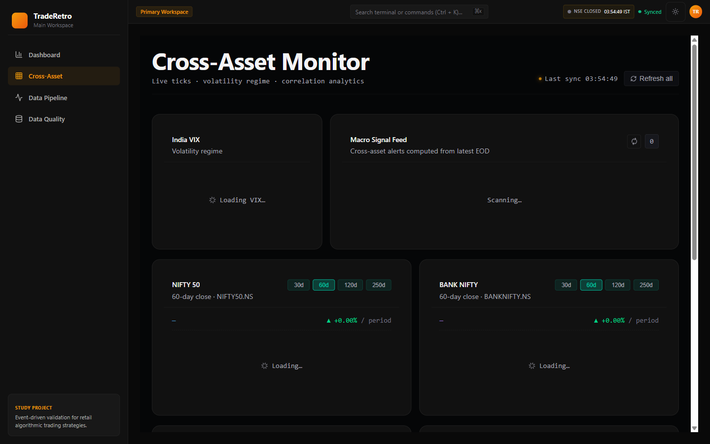
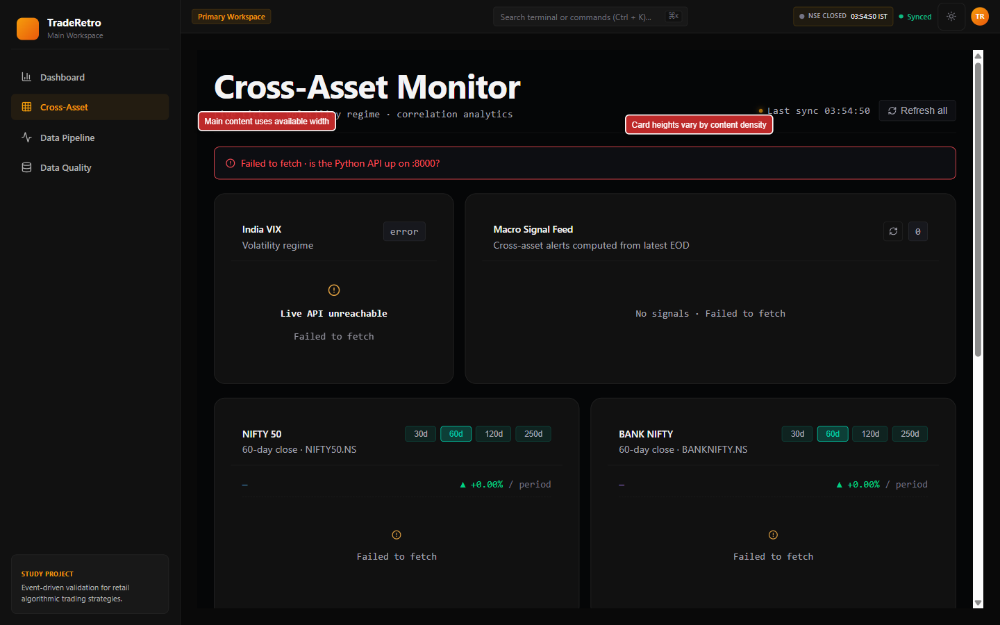
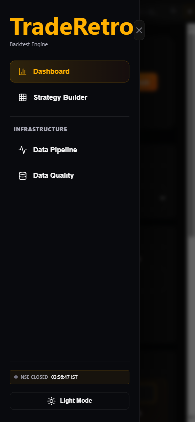
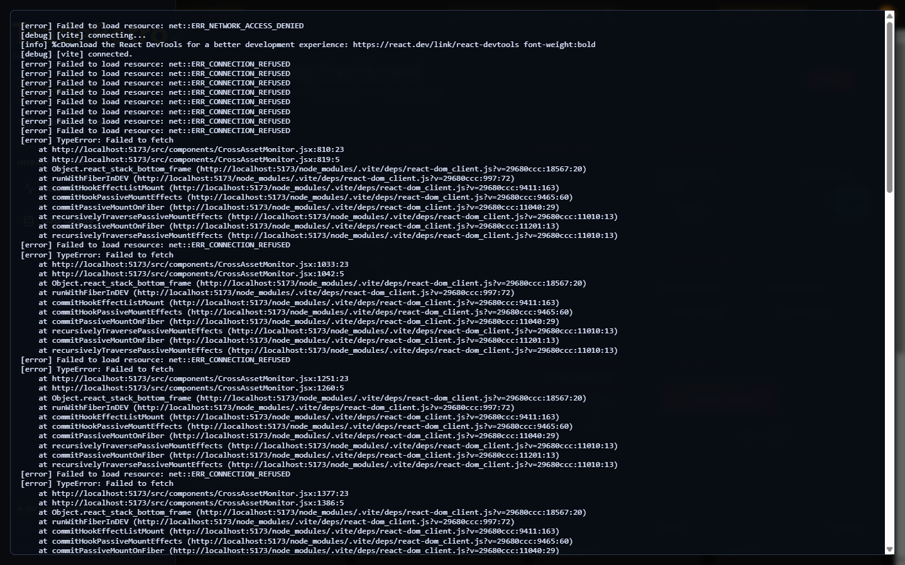

# TradeRetro Frontend Visual Review

Audit target: http://localhost:5173/  
Date: 2026-07-21  
Role: Senior QA Engineer, Frontend Architect, UX Auditor

## Screenshots

All requested screenshots were captured fresh during the walkthrough and saved in `frontend_review/`.

## Walkthrough Coverage

- Landing page: reached and entered via `Launch Terminal`.
- Dashboard: reached.
- Strategy Builder: present as the dashboard builder panel; no desktop sidebar route. It appears as a drawer item on mobile, but the visible desktop navigation does not expose it separately.
- Cross-Asset: reached.
- Data Pipeline: reached.
- Data Quality: reached.
- Settings: not reachable. No Settings navigation item, button, route link, drawer item, modal, or enabled command search result was available.
- Modal/drawer: mobile navigation drawer reached.
- Dropdown/forms: strategy dropdown, risk toggle, ticker/capital/date inputs inspected without persistent changes.
- Run Backtest: clicked; resulted in visible fetch failure state.
- Loading/empty/error states: captured where available.

## Summary

The application has a strong FinTech visual direction: dark terminal styling, compact sidebar navigation, status indicators, and structured operational panels. The sidebar is correctly attached to the left browser edge with no unnecessary left gutter on desktop. The main weaknesses are interaction completeness, data failure handling, mobile layout overlap, and excessive empty panel space in several desktop views.

## Issues

| Severity | Affected component | Issue | Suggested fix | Estimated effort |
|---|---|---|---|---|
| High | Data-dependent pages | Cross-Asset, Data Quality, and backtest execution emit repeated `Failed to fetch` errors and leave large loading/error surfaces. The app does not clearly distinguish backend unavailable, empty data, or request failure. | Add explicit service-offline/error states with retry, endpoint labels, and graceful fallback content. Debounce repeated failing polls. | 1-2 days |
| High | Mobile header/drawer | On 390px width, the menu button, workspace pill, search field, NSE badge, and right controls visually collide/overflow at the top. The drawer also leaves the blurred page visible with a strong vertical scrollbar. | Redesign mobile header as a single compact row; hide nonessential controls behind the drawer; lock body scroll while drawer is open. | 1 day |
| High | Strategy Builder desktop grid | Dashboard builder uses four tall columns, leaving large empty vertical areas in Strategy Selection, Parameters, and Risk Management. This makes the primary workflow feel sparse and uneven. | Use a denser responsive grid: group short controls into 2-column rows, keep Risk/Run panels closer, and reduce fixed panel heights. | 1-2 days |
| Medium | Header | Header contains a disabled command/search input and large empty horizontal space. It looks like an available feature but cannot be used. | Either enable command search or render it as a noninteractive status/search placeholder with disabled styling and tooltip. | 0.5-1 day |
| Medium | Navigation | Desktop sidebar has Dashboard, Cross-Asset, Data Pipeline, Data Quality. Mobile drawer additionally shows Strategy Builder, creating inconsistent navigation between breakpoints. | Align desktop and mobile nav models; expose Strategy Builder consistently or treat it as a section anchor on both. | 0.5 day |
| Medium | Settings | Settings was requested but not reachable. No Settings nav item, modal, or command palette result could be verified. | Add a visible Settings entry if planned, or remove Settings from expected IA. | 0.5-1 day |
| Medium | Data Pipeline | The Pipeline page shows a very large blank blue telemetry area with no legend, axes, loading indicator, empty explanation, or chart content. | Add skeleton/loading/empty-state messaging inside the telemetry panel and reserve chart space only when data exists. | 0.5-1 day |
| Medium | Data Quality table | Ticker Inventory table renders headers only with no empty-state row. The surrounding cards show `0 / 0` and `undefinedd ago`, which feels broken. | Normalize null/undefined formatting and add an empty inventory row explaining no ticker data is available. | 0.5 day |
| Medium | Market/dashboard vertical overflow | At 1440x900, the dashboard has a visible page scrollbar and key Market Overview content starts below the fold because top panels are too tall. | Reduce builder panel height, tighten hero spacing, and keep first market row visible without scrolling on common desktop heights. | 1 day |
| Medium | Run Backtest result state | After execution failure, the result panel appears far below the main controls and may be missed. | Surface execution status near the Run Backtest panel and anchor/scroll to results after run. | 0.5-1 day |
| Low | NSE status/header alignment | NSE status is visually aligned, but it competes with search, theme, sync, and avatar in a cramped cluster. | Group market/session status separately from user/theme controls and reduce chip visual weight. | 0.5 day |
| Low | Card consistency | Cards generally align, but content density varies sharply between panels, especially Cross-Asset loading cards and dashboard builder cards. | Standardize min-heights per row and use skeletons or compact empty states. | 0.5-1 day |
| Low | FinTech polish | The orange accent is strong and readable, but repeated large empty dark surfaces reduce perceived product maturity. | Add meaningful microcopy, telemetry legends, status affordances, and tighter information hierarchy. | 1 day |

## Specific Checks

1. Sidebar attached to left edge: Yes, desktop sidebar begins at x=0.
2. Unnecessary left gutter: No desktop left gutter observed.
3. Duplicated navigation: Partial inconsistency. Mobile drawer includes Strategy Builder while desktop sidebar does not.
4. Header excessive empty space: Yes, especially around the disabled command search area.
5. NSE status alignment: Mostly aligned on desktop; cramped on mobile.
6. Strategy Builder proper grid: Partially. It is aligned, but panel heights and empty space make the grid inefficient.
7. Run Backtest panel aligned: Yes, aligned in the right column, but status/result feedback is disconnected below.
8. Card overflow: No obvious desktop horizontal card overflow; mobile top controls overlap.
9. Horizontal scrolling: No desktop horizontal scrolling observed; mobile header/drawer state has cramped overflow risk.
10. Components visually disconnected: Yes, Run Backtest feedback and large telemetry/loading areas feel disconnected.
11. Inconsistent card heights: Yes, dashboard and Cross-Asset cards vary by content density.
12. Inconsistent spacing: Moderate inconsistencies between dense header/sidebar and sparse main panels.
13. Dashboard width efficiency: Partially efficient; right column uses space, but tall empty panels waste vertical space.
14. Professional desktop SaaS quality: Directionally yes, but backend error handling, disabled search, and empty states need polish.

## Console Findings

Captured in `frontend_review/20_console_errors.png`.

- `net::ERR_NETWORK_ACCESS_DENIED` occurred during app load.
- Repeated `net::ERR_CONNECTION_REFUSED` errors occurred while visiting data-heavy views.
- CrossAssetMonitor fetch failures were logged at multiple component locations.
- DataQualityDashboard fetch failures were logged repeatedly.

## Artifact List

- `frontend_review/01_full_dashboard.png`
- `frontend_review/02_sidebar.png`
- `frontend_review/03_header.png`
- `frontend_review/04_strategy_builder.png`
- `frontend_review/05_market_overview.png`
- `frontend_review/06_run_backtest.png`
- `frontend_review/07_cross_asset.png`
- `frontend_review/08_data_pipeline.png`
- `frontend_review/09_data_quality.png`
- `frontend_review/10_settings.png`
- `frontend_review/11_tables.png`
- `frontend_review/12_charts.png`
- `frontend_review/13_footer.png`
- `frontend_review/14_responsive_full.png`
- `frontend_review/15_scrollbars.png`
- `frontend_review/16_navigation.png`
- `frontend_review/17_hover_states.png`
- `frontend_review/18_empty_states.png`
- `frontend_review/19_loading_states.png`
- `frontend_review/20_console_errors.png`
- `frontend_review/annotated_dashboard_layout.png`
- `frontend_review/annotated_cross_asset.png`
